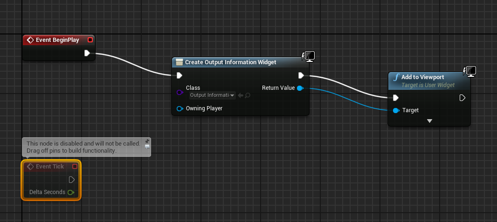
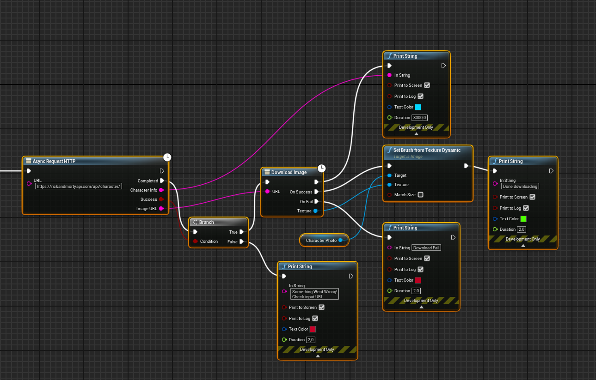

# HttpPlugin
Unreal Engine 4 plug-in that adds a simple widget that shows information about characters of "Rick and Morty"s show.

## Usage
1)Download plugin in "Plugins" directory of your project.
2)Build solution.
3)Enable new plugin in editor. Then add widget(output_information) to viewport.

3)Press on Play button. With each new launch, information about a random character is displayed on the screen.

